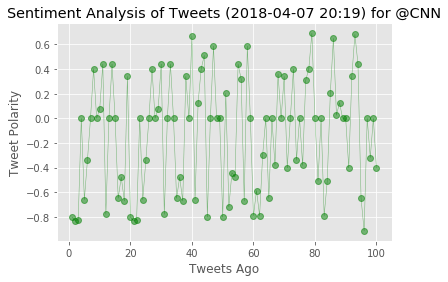
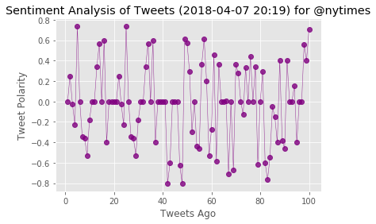
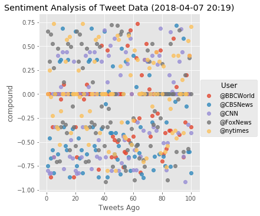

```python
#imports
import tweepy
import numpy as np
import pandas as pd
import seaborn as sns
from datetime import datetime
import matplotlib.pyplot as plt
from matplotlib import style
style.use('ggplot')
from config import api_key, api_secret, access_token, access_secret

from vaderSentiment.vaderSentiment import SentimentIntensityAnalyzer
analyzer = SentimentIntensityAnalyzer()

#Setup Tweepy API Authentication
auth = tweepy.OAuthHandler(api_key, api_secret)
auth.set_access_token(access_token, access_secret)
api = tweepy.API(auth, wait_on_rate_limit = True, parser=tweepy.parsers.JSONParser())
```


```python
#List of news agencies we will be doing the analysis on
target_users = ('@BBCWorld','@CBSNews','@CNN','@FoxNews','@nytimes')

#create a black list to hold the results
sentiments = []


#iterate through each of the search terms
for target in target_users:
    
    #Create counter
    counter = 1
    tweet_count = 0
    #loop through multiple pages of tweets
    for x in range(8):
        public_tweets = api.user_timeline(target, page = x)
        for tweet in public_tweets:
            #continue looking at tweets only if the tweet count is less than 100
            if tweet_count < 100:
                #only analyze original tweets from the news agencies, not retweets
                if not tweet['retweeted'] and 'RT @' not in tweet['text']:
                    tweet_text = tweet['text']
                        
                    results = analyzer.polarity_scores(tweet_text)
                    compound = results['compound']
                    positive = results['pos']
                    neutral = results['neu']
                    negative = results['neg']
                    tweets_ago = counter
                
                    tweets_ago = tweet['id']-1
                    sentiments.append({"User": target, "compound": compound, "Positive": positive, "Negative": negative, "Neutral": neutral, "Tweets Ago": counter})
                
                    counter += 1
                    tweet_count += 1
                    print(tweet_text)
                    print('---------------------')
```

    Trump Tower fires: Blaze breaks out at New York property https://t.co/Wrev20IsB8
    ---------------------
    Brazil's Lula surrenders to police https://t.co/6T9D4d5cGk
    ---------------------
    Canada hockey team crash: 'Entire country in shock' at tragedy https://t.co/ely2UEKUu4
    ---------------------
    Vatican police arrest ex-diplomat over 'child pornography' https://t.co/HHXmGkTDAz
    ---------------------
    Israel to investigate killing of Palestinian journalist https://t.co/8kudrlTVuS
    ---------------------
    Lula to surrender to police https://t.co/ksRE4gjgAA
    ---------------------
    Prince of Wales gets new chief title in ceremony on South Pacific island of Vanuatu https://t.co/z1jSGRh4Hm
    ---------------------
    Van drives into pedestrians in Germany https://t.co/0xtrQps5IL
    ---------------------
    The migrant caravan from Central America travelling north https://t.co/gOwYZhuDUy
    ---------------------
    Facebook suspends AIQ data firm used by Vote Leave in Brexit campaign https://t.co/FchzO29YDp
    ---------------------
    Prince Charles gets new Chief title on Vanuatu https://t.co/tEMQkCyOwB
    ---------------------
    Samba Diop: Le Havre defender dies aged 18 https://t.co/kCM7X5U7Fk
    ---------------------
    Grass skirt in Vanuatu for 'high chief' Prince Charles https://t.co/B9mEo6ShFQ
    ---------------------
    Mexico's president @EPN quotes JFK during national broadcast addressed to @realDonaldTrump https://t.co/8IbnhGiScP
    ---------------------
    Lula: Brazil ex-president's police stand-off https://t.co/Gro8VHwqUe
    ---------------------
    Mexico to Trump: Don't take your 'frustrations' out on us https://t.co/xFKKRqVkWE
    ---------------------
    Trump Tower fires: Blaze breaks out at New York property https://t.co/Wrev20IsB8
    ---------------------
    Brazil's Lula surrenders to police https://t.co/6T9D4d5cGk
    ---------------------
    Canada hockey team crash: 'Entire country in shock' at tragedy https://t.co/ely2UEKUu4
    ---------------------
    Vatican police arrest ex-diplomat over 'child pornography' https://t.co/HHXmGkTDAz
    ---------------------
    Israel to investigate killing of Palestinian journalist https://t.co/8kudrlTVuS
    ---------------------
    Lula to surrender to police https://t.co/ksRE4gjgAA
    ---------------------
    Prince of Wales gets new chief title in ceremony on South Pacific island of Vanuatu https://t.co/z1jSGRh4Hm
    ---------------------
    Van drives into pedestrians in Germany https://t.co/0xtrQps5IL
    ---------------------
    The migrant caravan from Central America travelling north https://t.co/gOwYZhuDUy
    ---------------------
    Facebook suspends AIQ data firm used by Vote Leave in Brexit campaign https://t.co/FchzO29YDp
    ---------------------
    Prince Charles gets new Chief title on Vanuatu https://t.co/tEMQkCyOwB
    ---------------------
    Samba Diop: Le Havre defender dies aged 18 https://t.co/kCM7X5U7Fk
    ---------------------
    Grass skirt in Vanuatu for 'high chief' Prince Charles https://t.co/B9mEo6ShFQ
    ---------------------
    Mexico's president @EPN quotes JFK during national broadcast addressed to @realDonaldTrump https://t.co/8IbnhGiScP
    ---------------------
    Lula: Brazil ex-president's police stand-off https://t.co/Gro8VHwqUe
    ---------------------
    Mexico to Trump: Don't take your 'frustrations' out on us https://t.co/xFKKRqVkWE
    ---------------------
    Salman Khan, Bollywood superstar, bailed in poaching case https://t.co/nXoRkeloES
    ---------------------
    Russell Crowe 'divorce auction': Memorabilia up for grabs in Sydney https://t.co/kWq0PCTeLP
    ---------------------
    Millions watch extreme eating Korean mukbang star https://t.co/wpyDBBAAHH
    ---------------------
    Canada crash: Fatalities as junior hockey team's bus and lorry collide https://t.co/maMBAttjt8
    ---------------------
    Trump immigration: Texas sends National Guard to Mexico border https://t.co/tPfoQHNmiC
    ---------------------
    Vietnam rescue dog gives new owner slip in Paris https://t.co/STYop10ASH
    ---------------------
    Masters 2018: Patrick Reed two ahead at halfway stage https://t.co/uaoUk3l8Dt
    ---------------------
    Molly Ringwald: The Breakfast Club star 'troubled' by hit film https://t.co/7203aQtw3y
    ---------------------
    Viktor Orban: Hungary's nationalist PM eyes third term https://t.co/ovz0AW6yIj
    ---------------------
    Anna Chennault: 'Steel butterfly' who charmed US and China https://t.co/nkUPRi4iwh
    ---------------------
    Week in pictures: 31 March - 6 April 2018 https://t.co/EeMNhTtOxp
    ---------------------
    Bosnia: Cable car in Sarajevo reopens after 26 years https://t.co/1DIOqlscNP
    ---------------------
    Menendez brothers convicted of killing parents reunite in jail https://t.co/THZqwTIN4B
    ---------------------
    Gaza protests: further deaths in renewed border protest https://t.co/wEajQNEp7H
    ---------------------
    Dozens sue Canadian fertility doctor for 'using wrong sperm' https://t.co/fzvcx0Yimp
    ---------------------
    Syria war: Jets strike rebel-held Eastern Ghouta as evacuation stalls https://t.co/e8OJLEtX8T
    ---------------------
    Park Geun-hye: Poisoned chalice of South Korea's presidency https://t.co/221EoYfAQq
    ---------------------
    Virgin Galactic spaceship completes test flight https://t.co/RPMaUgMcXz
    ---------------------
    Black bear's hibernation is webcam hit https://t.co/M2ULkeaVmg
    ---------------------
    When the weather is so cold that you can't bear to get up 🐻 https://t.co/v2F03V5DNw
    ---------------------
    Hundreds protests after New York police kill man wielding pipe https://t.co/kFCxmekwef
    ---------------------
    Trial begins in Goa over Irishwoman's death https://t.co/N5PNvc8PGS
    ---------------------
    UFC fighter Conor McGregor seen in handcuffs after being charged with assault by NYPD 
    
    https://t.co/I7NCUzoTTt https://t.co/7zEQTTMSxR
    ---------------------
    Spain hopeful of Gibraltar deal with the UK by summer https://t.co/tl0AJ2bleZ
    ---------------------
    US punishes 24 Russians over worldwide 'malign activity' https://t.co/6hVFkPms7l
    ---------------------
    Amazing Amazon discoveries.
    
    Nine new species found where few scientists have gone before https://t.co/zotjXICtnJ… https://t.co/FXFrls1tKQ
    ---------------------
    Antarctica: A journey to the edge of a frozen continent https://t.co/xzKdZBeUat
    ---------------------
    Zuma's supporters drown out charges in song https://t.co/78CqEu7E2b
    ---------------------
    The Swedes rebelling against a cashless society https://t.co/upLlZegsou
    ---------------------
    US jobs growth slows in March https://t.co/hmJZTt8BOF
    ---------------------
    China sperm bank demands Communist Party loyalty from donors https://t.co/XVuL2Xe1Xa
    ---------------------
    Russian spy poisoning: Sergei Skripal 'improving rapidly' https://t.co/ztf8RzkgRe
    ---------------------
    Russia's UN ambassador says UK is "playing with fire" and has invented a "fake story" about poisoning of former spy… https://t.co/xiThJdOWl7
    ---------------------
    Lorde apologises for posting a bath photo with Whitney lyric https://t.co/it0lz5e3jq
    ---------------------
    Brazil's Lula 'will not turn himself in to police' https://t.co/0uGHW5Tmvb
    ---------------------
    Meet the gargantuan air freighter that looks like a whale https://t.co/ZPG1XN38Pn
    ---------------------
    Henry and Baloo: Dog and cat travel companions gain cult following https://t.co/SJuJkyu5E1
    ---------------------
    Antarctica: A journey to the edge of a frozen continent 🐧
    
    https://t.co/9OZwG3JtRV https://t.co/OQeewXi3jM
    ---------------------
    Uzbekistan TV show chastised for shaming public lovers https://t.co/PFQBneS1ww
    ---------------------
    Russia seeks to block Telegram messaging app https://t.co/p1UIIbUwI0
    ---------------------
    Gaza-Israel border clashes erupt as protests begin https://t.co/imuCdSQxkw
    ---------------------
    India man 'mummified and froze mother's body' for three years https://t.co/3vAs78Xvwh
    ---------------------
    Jordan Peele to make Lerena Bobbitt film https://t.co/bGIjgmDsr8
    ---------------------
    It's not just spiders, scorpions and snakes 🕷️🦂🐍
    
    Meet the pest controller keeping troops safe in Afghanistan https://t.co/4YEecAjSFr
    ---------------------
    South Africa's former President Jacob Zuma has been charged with corruption relating to a 1990s arm deal
    
    https://t.co/s7rfyL5g2E
    ---------------------
    UFC star Conor McGregor in New York custody https://t.co/JmarJVQzbU
    ---------------------
    New York judge awards Egon Schiele art to Holocaust heirs https://t.co/1drszwLdXf
    ---------------------
    S Korea's ex-leader guilty of abusing power https://t.co/neEvptvtia
    ---------------------
    Conor McGregor turns himself in after violence at UFC event in New York https://t.co/7Gq5DICFnb
    ---------------------
    The Mooch, Trump and a gold-plated bathtub https://t.co/wK6PlAQvAu
    ---------------------
    Skripal phone call: 'I have no doubt it was Yulia' https://t.co/827HlYKxYC
    ---------------------
    The pest controller of Kandahar https://t.co/csv3PugCwR
    ---------------------
    'Grave of the Fireflies' director Isao Takahata dies at 82 https://t.co/fHoxF9e51m
    ---------------------
    Trump threatens further $100bn in tariffs against China https://t.co/A8PdsH841c
    ---------------------
    Australia 'shocked' by sheep deaths on ship https://t.co/IcfM5PvXek
    ---------------------
    Saudi 'Prince Charming' Mohammed bin Salman comes to Hollywood https://t.co/15sxktzJPF
    ---------------------
    Will Netflix's Amo be the Philippine Narcos? https://t.co/DeOl2sN8Zd
    ---------------------
    Do Syrian refugees ever want to return home? https://t.co/PRzRkoDDoT
    ---------------------
    Africa's week in pictures: 30 March-5 April https://t.co/HoB5TnyqND
    ---------------------
    Gay Chechens flee threats, beatings and exorcism https://t.co/7yWm97sT3u
    ---------------------
    Brazil judge tells Lula to turn himself in on Friday https://t.co/JjC6NVRwv6
    ---------------------
    Stormy Daniels: Trump says he did not know about $130,000 payment https://t.co/vbeZGax1RI
    ---------------------
    Spy poisoning: Russia says UK is 'playing with fire' https://t.co/gIL9Iftyx3
    ---------------------
    Pressure builds on Trump environment chief https://t.co/Hvf51NzA0E
    ---------------------
    US top doctor urges Americans to carry opioid antidote https://t.co/zskdD3UgwY
    ---------------------
    Russian TV airs 'Skripal phone call' https://t.co/ig2MgVmUek
    ---------------------
    Carles Puigdemont freed on bail by German court https://t.co/aO66GcGbHU
    ---------------------
    Quokka selfies: Is Instagram's welfare warning 'overkill'? https://t.co/uuuVZT2E1d
    ---------------------
    Family outraged after video of toddler frightened by the Easter Bunny goes viral https://t.co/YZYCniGYeM https://t.co/RAao2tYBQE
    ---------------------
    Doctors warn of "second wave" of the flu https://t.co/dqBi324C6L https://t.co/zYDcRA1h0N
    ---------------------
    UPDATE: The FDNY commissioner said 1 person is in critical condition and 4 firefighters suffered minor injuries in… https://t.co/kbxBCa67KM
    ---------------------
    Trump Tower fire: Fire breaks out on 50th floor, FDNY says https://t.co/kizrQ1Fzgo https://t.co/VTiXQpbiu1
    ---------------------
    Assault weapons ban doesn't violate 2nd Amendment, judge says https://t.co/8lXMOyntXX https://t.co/PAjqxjdzOY
    ---------------------
    First grader discovers her “new” textbook was used by Blake Shelton — in 1982 https://t.co/oEL3A8ztlA https://t.co/GQDEeeyNPU
    ---------------------
    "I'm not going to be a Gabby Giffords": Congressman pulls out gun at constituent meeting https://t.co/jgVR9eUvwj https://t.co/5POjyKMEeT
    ---------------------
    Opioid crisis: Facebook shuts down drug hashtags on Instagram https://t.co/cuIcjS6PWR https://t.co/PNSly4Ea0h
    ---------------------
    Homeland Security to compile database of journalists, media influencers https://t.co/7UJs8adrYN https://t.co/Qb9DZzOB2T
    ---------------------
    Sean Hannity vows to bash Jimmy Kimmel until he apologizes to Melania Trump https://t.co/F1vuC0pqdw https://t.co/9CHtfktEhu
    ---------------------
    YouTube's changes to the way people can profit from popular videos were thrust into the spotlight last week after a… https://t.co/7Z0NIIRNzs
    ---------------------
    President Trump tweeted the fire at NYC's Trump Tower is "out" https://t.co/ALSnsTYdUq https://t.co/e3WC9nSDOr
    ---------------------
    JUST IN: Firefighters are battling a fire on the 50th floor of Trump Tower in NYC https://t.co/wAyaj9EdgS https://t.co/9Prxuj040Y
    ---------------------
    Even in gun country, Democrats shift towards gun control https://t.co/HF1DMzkf88 https://t.co/Iwzchknq1I
    ---------------------
    “I have some rather startling news to tell you.”-- Where is Marsha Brantley? Join the investigation Saturday at 10/… https://t.co/n2AWKFs7kT
    ---------------------
    UPDATE: 15 dead, 14 injured after Canadian junior hockey team bus crash
    https://t.co/xZNf3yB2pI https://t.co/BKc4AXIvGf
    ---------------------
    "We are sealing up our southern border": President Trump speaks out on National Guard deployment… https://t.co/hKULoPNh4D
    ---------------------
    A student gravely wounded while saving his classmates' lives during the Florida school massacre says the county she… https://t.co/fYESGFCz94
    ---------------------
    House Oversight Committee has requested and received documents related to EPA chief Scott Pruitt's renting of a con… https://t.co/0k6oewa1MY
    ---------------------
    Researchers are eager to better understand Northern California's "atmospheric river storm," so they're launching we… https://t.co/HcPJcWq3Gw
    ---------------------
    Family outraged after video of toddler frightened by the Easter Bunny goes viral https://t.co/YZYCniGYeM https://t.co/RAao2tYBQE
    ---------------------
    Doctors warn of "second wave" of the flu https://t.co/dqBi324C6L https://t.co/zYDcRA1h0N
    ---------------------
    UPDATE: The FDNY commissioner said 1 person is in critical condition and 4 firefighters suffered minor injuries in… https://t.co/kbxBCa67KM
    ---------------------
    Trump Tower fire: Fire breaks out on 50th floor, FDNY says https://t.co/kizrQ1Fzgo https://t.co/VTiXQpbiu1
    ---------------------
    Assault weapons ban doesn't violate 2nd Amendment, judge says https://t.co/8lXMOyntXX https://t.co/PAjqxjdzOY
    ---------------------
    First grader discovers her “new” textbook was used by Blake Shelton — in 1982 https://t.co/oEL3A8ztlA https://t.co/GQDEeeyNPU
    ---------------------
    "I'm not going to be a Gabby Giffords": Congressman pulls out gun at constituent meeting https://t.co/jgVR9eUvwj https://t.co/5POjyKMEeT
    ---------------------
    Opioid crisis: Facebook shuts down drug hashtags on Instagram https://t.co/cuIcjS6PWR https://t.co/PNSly4Ea0h
    ---------------------
    Homeland Security to compile database of journalists, media influencers https://t.co/7UJs8adrYN https://t.co/Qb9DZzOB2T
    ---------------------
    Sean Hannity vows to bash Jimmy Kimmel until he apologizes to Melania Trump https://t.co/F1vuC0pqdw https://t.co/9CHtfktEhu
    ---------------------
    YouTube's changes to the way people can profit from popular videos were thrust into the spotlight last week after a… https://t.co/7Z0NIIRNzs
    ---------------------
    President Trump tweeted the fire at NYC's Trump Tower is "out" https://t.co/ALSnsTYdUq https://t.co/e3WC9nSDOr
    ---------------------
    JUST IN: Firefighters are battling a fire on the 50th floor of Trump Tower in NYC https://t.co/wAyaj9EdgS https://t.co/9Prxuj040Y
    ---------------------
    Even in gun country, Democrats shift towards gun control https://t.co/HF1DMzkf88 https://t.co/Iwzchknq1I
    ---------------------
    “I have some rather startling news to tell you.”-- Where is Marsha Brantley? Join the investigation Saturday at 10/… https://t.co/n2AWKFs7kT
    ---------------------
    UPDATE: 15 dead, 14 injured after Canadian junior hockey team bus crash
    https://t.co/xZNf3yB2pI https://t.co/BKc4AXIvGf
    ---------------------
    "We are sealing up our southern border": President Trump speaks out on National Guard deployment… https://t.co/hKULoPNh4D
    ---------------------
    A student gravely wounded while saving his classmates' lives during the Florida school massacre says the county she… https://t.co/fYESGFCz94
    ---------------------
    House Oversight Committee has requested and received documents related to EPA chief Scott Pruitt's renting of a con… https://t.co/0k6oewa1MY
    ---------------------
    Researchers are eager to better understand Northern California's "atmospheric river storm," so they're launching we… https://t.co/HcPJcWq3Gw
    ---------------------
    A magnitude 4.6 earthquake shook Oklahoma and was also felt in neighboring Kansas and Missouri, according to the U.… https://t.co/j4aR2vBFyg
    ---------------------
    "It's got to rip the heart out of your chest ... Horrific, horrific accident." Toronto @MapleLeafs head coach Mike… https://t.co/BDthsMNWFJ
    ---------------------
    A survivor of the Florida school shooting has joined the Rev. Al Sharpton to announce a June rally against gun viol… https://t.co/whAqe9xgBY
    ---------------------
    "The driver is not in custody. As part of the process of the investigation, the driver was detained initially. Our… https://t.co/qsilZy5XpK
    ---------------------
    15 people were sent to the hospital with a variety of injuries after deadly bus crash in Canada and some of the inj… https://t.co/NSUY8UPS9L
    ---------------------
    A pair of Pennsylvania goats were rescued after they found themselves in a tricky situation: https://t.co/qlIEHXZNfu https://t.co/uW49I7AQLl
    ---------------------
    "I don't have a lot to say, other than the worst nightmare has happened," Saskatchewan Junior Hockey League preside… https://t.co/dJ79evrMem
    ---------------------
    "On behalf of the entire Broncos family, our deepest sympathies go to the injured and the deceased and, of course,… https://t.co/Tl4ZoUtS7e
    ---------------------
    WATCH LIVE: Canadian officials are giving an update on the hockey team bus collision that killed 14 people… https://t.co/UDDqKzYIBC
    ---------------------
    Will Blake Farenthold reimburse taxpayers for $84,000 harassment settlement?
    https://t.co/e6GlLofO3q https://t.co/U0IJYlbmIC
    ---------------------
    Hundreds attend funeral of well-known Palestinian journalist in Gaza who was killed while covering mass protests al… https://t.co/tE9cC3VLNb
    ---------------------
    One eyewitness and resident in Muenster, Germany, says he is feeling less safe after a van crashed into a crowd of… https://t.co/AwrKr4oaKn
    ---------------------
    The incident in Muenster, Germany, is being treated as terrorism, but the suspect's identification has not yet been… https://t.co/Mv0gY13wvt
    ---------------------
    Charter bus shooting leaves 3 dead in Rockford, Illinois; suspect at large
    https://t.co/T5S7wPkiXl https://t.co/PZE2DaR36O
    ---------------------
    President Trump's sons' visit to Dubai this week has costed taxpayers a minimum of $73,000 in security costs, accor… https://t.co/LG9CogwE4Y
    ---------------------
    Road collapses in Pittsburgh, prompting evacuations: https://t.co/5zdUQN9FTB https://t.co/X43hRg3ZbZ
    ---------------------
    Police in Muenster, Germany, said a vehicle crashed into a crowd there, killing several people and injuring others:… https://t.co/XyDO10SOp7
    ---------------------
    2 soldiers were killed Friday in an Apache helicopter crash at Fort Campbell in Kentucky, authorities say… https://t.co/GxmalhEIhv
    ---------------------
    MORE: Police say a suspicious object has been found in the van that ran into the crowd in Muenster, Germany. They s… https://t.co/AgqpH88ffa
    ---------------------
    President Trump has begun to informally prepare for a possible interview with special counsel Robert Mueller, CBS N… https://t.co/XY89SBX6Ry
    ---------------------
    At least 4 people, including the driver, are dead after a driver plowed into a crowd of people near a pub in Muenst… https://t.co/5XvhBtCC7n
    ---------------------
    "So far we do not know if the shooter shouted anything. No witnesses have said something like that. What we know is… https://t.co/za7H2qWGUQ
    ---------------------
    "We do not know if this was a terror attack," Berlin journalist Anna Noryskiewicz says of incident in Muenster, Ger… https://t.co/FMO1WQBzvV
    ---------------------
    UPDATE: Around 30 people are injured and 6 are in a critical condition after a vehicle crashed into a crowd in Germ… https://t.co/klVahTCCgA
    ---------------------
    "I'm not going to be a Gabby Giffords": Republican U.S. Rep. Ralph Norman pulls out gun at constituent meeting… https://t.co/HWmKvfno9I
    ---------------------
    MORE: Several dead, others injured after car crashes into crowd in Germany, police say https://t.co/wE3EboRJqU https://t.co/ygaBMcg4BN
    ---------------------
    A tight-knit Canadian community is trying to make sense of a tragedy after 14 people were killed when a truck colli… https://t.co/MVcVNWrsTq
    ---------------------
    DEVELOPING: A vehicle reportedly drove into pedestrians in the German city of Muenster; local police confirmed ther… https://t.co/dx1IUPxQbN
    ---------------------
    When an Oklahoma first grader found out she was using the same textbook as country music star @blakeshelton, she wa… https://t.co/f8Y05dTEB7
    ---------------------
    EPA spent millions on security for embattled chief Scott Pruitt, a new report says https://t.co/mTMFuAa0UC https://t.co/hp8gs5GdII
    ---------------------
    The White House sent mixed signals on Friday as financial markets slid from investor concern about a significant tr… https://t.co/sJBM1pP6Gr
    ---------------------
    Steve Spurrier has been announced as the head coach of the inaugural team of the Alliance of American Football, bas… https://t.co/aVt3GyxbKf
    ---------------------
    Northern California rains raise flood concerns; warnings and watches in effect
    https://t.co/sjDHTUxp2Y https://t.co/8gYBsSVU6T
    ---------------------
    A crash between a transport truck and a bus carrying a junior hockey team in Western Canada left 14 people dead and… https://t.co/cT28Z1wQVh
    ---------------------
    Minneapolis activist shot dead on his mother's front porch https://t.co/pR2ANQzfCh https://t.co/77OLIwwR9r
    ---------------------
    2018 Atlantic hurricane season will be slightly above-average, researchers say https://t.co/y6zDG44xsO https://t.co/Zqlr7xhBj9
    ---------------------
    Steve Spurrier to coach Orlando team in new spring league, Alliance of American Football https://t.co/Q624CmNL5Z https://t.co/CUZIHJddLI
    ---------------------
    Deadly violence for 2nd week on Gaza-Israel border https://t.co/tbFfBNWZg0 https://t.co/U8jYWE8l5J
    ---------------------
    Who is Steve Spurrier? https://t.co/DKlzyg6PfC https://t.co/zdjgDAdUQr
    ---------------------
    Just announced on @CBSThisMorning: A new professional spring football league called @TheAAF reveals Orlando, Florid… https://t.co/09JR70cmfc
    ---------------------
    Details emerge about teens found dead in mine shaft https://t.co/gkUOhjtseR https://t.co/g0uxkFUqDz
    ---------------------
    Family outraged after video of toddler frightened by the Easter Bunny goes viral https://t.co/RXYJhN0SyV https://t.co/2qa2MObIeB
    ---------------------
    Northern California rains raise flood concerns; warnings and watches in effect https://t.co/OruRQXIEyx https://t.co/yN4J8Ca1Cq
    ---------------------
    Bald eagle lands on Mariners pitcher James Paxton before game https://t.co/YloMFpvlvg https://t.co/IZEV65Etfn
    ---------------------
    What is shingles? A look at the virus after Lin-Manuel Miranda's diagnosis https://t.co/V4lOfeD5E7 https://t.co/fAvZynos0N
    ---------------------
    Cops: Woman accused of murdering wife called it a "mistake" https://t.co/8CWGlbH3Os https://t.co/pchE5zHS5w
    ---------------------
    Police: Mom used kitchen knife to decapitate 7-year-old son https://t.co/ZDznBmhdQ5 https://t.co/JSzxZx5c1f
    ---------------------
    Police: Mom used kitchen knife to decapitate 7-year-old son https://t.co/NRmjD5sMt3 https://t.co/JxBbJtpYCp
    ---------------------
    L.A. residents complain GPS app Waze is creating "insanity" on their street https://t.co/VmreDdKMfY https://t.co/9B0X0dNtmZ
    ---------------------
    Deck hand saved lives as fishing boat sank; captain's role under investigation https://t.co/mZskkyNt9T https://t.co/GRhnSVbYlJ
    ---------------------
    Officer shows off "stanky leg" dance moves at Chattanooga Easter egg hunt https://t.co/mUFFq5CHtq https://t.co/hzUsxoj7UJ
    ---------------------
    Alison Krauss, Brad Paisley and others give Johnny Cash's poetry a second life in new album https://t.co/oYvqYZ8zwh https://t.co/48KAAtPYhy
    ---------------------
    Lobbyist tied to condo rented by EPA chief Scott Pruitt speaks out https://t.co/5LXWI7z0rq https://t.co/n805TrAVFH
    ---------------------
    Sisters in service: Carrying on a century-long tradition of military service https://t.co/4P74PYoyUB https://t.co/b7oUXiN66o
    ---------------------
    Virgin Galactic chalks up successful supersonic test flight https://t.co/XbrLVJ7uJM
    ---------------------
    Heavy rain in Northern California may test spillway at nation's tallest dam https://t.co/l5VwA8B8Wr https://t.co/WmRRqx3FBr
    ---------------------
    Ex-teacher cries in court as he admits fleeing with 15-year-old Tennessee student https://t.co/3lY5QCBZv6 https://t.co/iX1L1mT70O
    ---------------------
    Trump says trade war is "already lost," and he "probably won't" attend White House Correspondents Dinner… https://t.co/hRu3E1WJjS
    ---------------------
    PetSmart faces another dog death https://t.co/Hmhu2woX5L https://t.co/nd3aS1teQB
    ---------------------
    Menendez brothers, convicted of killing parents in 1989, reunited in prison https://t.co/uCw4NjZfQ1 https://t.co/d4HXdUKLPm
    ---------------------
    The body of a female was found in the immediate vicinity of a crash in California that killed at least 5 members of… https://t.co/HGuaeTUhWA
    ---------------------
    “We talked about death all the time … he’d say, 'death is the ultimate democracy. Everybody has got to die'”: Civil… https://t.co/x6RwelBh72
    ---------------------
    Several Syrian activist groups say a toxic gas attack killed dozens of people in Ghouta. The Syrian regime says it'… https://t.co/rsqaEjmnGL
    ---------------------
    'Black Panther' was “always” going to tackle “political issues head on,” says the film’s director, Ryan Coogler… https://t.co/ey8JNVnON7
    ---------------------
    "Our democracy was hacked before Vladimir Putin ... it was hacked by big money," former Vice President Al Gore tell… https://t.co/ikSaN8SnQe
    ---------------------
    Al Gore tells @VanJones68 that President Trump "ought to fire" Environmental Protection Agency administrator Scott… https://t.co/0cAw6kPtD6
    ---------------------
    Roger Stone, a longtime associate of President Trump, claimed to know of WikiLeaks email release date, despite sayi… https://t.co/SR0x1MnEAF
    ---------------------
    "I would bet on American democracy surviving this bleak period, for sure, but the challenge is stiffer than any we'… https://t.co/ll50N03cIC
    ---------------------
    President Trump defends tariffs amid jittery markets https://t.co/lUIz1ErTrK https://t.co/HcjlVpNaUP
    ---------------------
    President Trump criticizes the FBI and Justice Department, asking what they "have to hide" https://t.co/epRv6UsJHF https://t.co/uidS6CVy2c
    ---------------------
    He faced an impossible decision. But were Pope Pius XII’s actions during WWII worthy of sainthood? #Pope tomorrow a… https://t.co/BprHdexTGc
    ---------------------
    With 16 service members killed in air crashes, top lawmaker says "readiness of the military is at a crisis point"… https://t.co/ujzu7leTHg
    ---------------------
    Democrats call for investigations into Interior Secretary Ryan Zinke, National Park Service https://t.co/YwUw7VbDbu https://t.co/UhFqSF7NMS
    ---------------------
    New proposal wouldn't impact endangered species currently protected https://t.co/axiXqHcG5G https://t.co/aaG7SefcxN
    ---------------------
    VA dismisses privatization talk after leadership change https://t.co/DJglkb8ig8 https://t.co/S3ah2noKY8
    ---------------------
    2 dead after delivery vehicle hits crowd in German city of Muenster https://t.co/8cjUNOM4dy https://t.co/KoUtKbldAK
    ---------------------
    President Trump says US "sealing up" southern border, demands China "end unfair trade" https://t.co/aIlCNFZWLZ https://t.co/nDxqOnmM4u
    ---------------------
    What we know about a van that slammed into a crowd in Germany:
    ■ 2 people have been killed and at least 20 injured,… https://t.co/NDXF2jDMxb
    ---------------------
    EPA Administrator Scott Pruitt faces renewed questions over cost of security detail https://t.co/ssjQWTRmdA https://t.co/lDiuboCk4D
    ---------------------
    The body of a female was found in the immediate vicinity of a crash in California that killed at least 5 members of… https://t.co/HGuaeTUhWA
    ---------------------
    “We talked about death all the time … he’d say, 'death is the ultimate democracy. Everybody has got to die'”: Civil… https://t.co/x6RwelBh72
    ---------------------
    Several Syrian activist groups say a toxic gas attack killed dozens of people in Ghouta. The Syrian regime says it'… https://t.co/rsqaEjmnGL
    ---------------------
    'Black Panther' was “always” going to tackle “political issues head on,” says the film’s director, Ryan Coogler… https://t.co/ey8JNVnON7
    ---------------------
    "Our democracy was hacked before Vladimir Putin ... it was hacked by big money," former Vice President Al Gore tell… https://t.co/ikSaN8SnQe
    ---------------------
    Al Gore tells @VanJones68 that President Trump "ought to fire" Environmental Protection Agency administrator Scott… https://t.co/0cAw6kPtD6
    ---------------------
    Roger Stone, a longtime associate of President Trump, claimed to know of WikiLeaks email release date, despite sayi… https://t.co/SR0x1MnEAF
    ---------------------
    "I would bet on American democracy surviving this bleak period, for sure, but the challenge is stiffer than any we'… https://t.co/ll50N03cIC
    ---------------------
    President Trump defends tariffs amid jittery markets https://t.co/lUIz1ErTrK https://t.co/HcjlVpNaUP
    ---------------------
    President Trump criticizes the FBI and Justice Department, asking what they "have to hide" https://t.co/epRv6UsJHF https://t.co/uidS6CVy2c
    ---------------------
    He faced an impossible decision. But were Pope Pius XII’s actions during WWII worthy of sainthood? #Pope tomorrow a… https://t.co/BprHdexTGc
    ---------------------
    With 16 service members killed in air crashes, top lawmaker says "readiness of the military is at a crisis point"… https://t.co/ujzu7leTHg
    ---------------------
    Democrats call for investigations into Interior Secretary Ryan Zinke, National Park Service https://t.co/YwUw7VbDbu https://t.co/UhFqSF7NMS
    ---------------------
    New proposal wouldn't impact endangered species currently protected https://t.co/axiXqHcG5G https://t.co/aaG7SefcxN
    ---------------------
    VA dismisses privatization talk after leadership change https://t.co/DJglkb8ig8 https://t.co/S3ah2noKY8
    ---------------------
    2 dead after delivery vehicle hits crowd in German city of Muenster https://t.co/8cjUNOM4dy https://t.co/KoUtKbldAK
    ---------------------
    President Trump says US "sealing up" southern border, demands China "end unfair trade" https://t.co/aIlCNFZWLZ https://t.co/nDxqOnmM4u
    ---------------------
    What we know about a van that slammed into a crowd in Germany:
    ■ 2 people have been killed and at least 20 injured,… https://t.co/NDXF2jDMxb
    ---------------------
    EPA Administrator Scott Pruitt faces renewed questions over cost of security detail https://t.co/ssjQWTRmdA https://t.co/lDiuboCk4D
    ---------------------
    "I don't have a lot of patience for that kind of stuff." Republican Rep. Trey Gowdy is probing the actions of embat… https://t.co/cFkgfnYQ0g
    ---------------------
    Manchester City stunned by rivals Manchester United in thrilling derby https://t.co/MeoSIyZsFl https://t.co/d8gWWw26ZG
    ---------------------
    4 teens who dropped sandbag on car, killing man, ordered to youth facility https://t.co/nvwDwVbvL7 https://t.co/e0WqSSbohZ
    ---------------------
    GOP keeps up hope amid challenge in key California battleground https://t.co/V7RB25EWjp https://t.co/44lh3ysSqy
    ---------------------
    They're moms. They're attorneys. They believe they can help end the Oklahoma teacher walkouts.… https://t.co/mKK8CHyEqY
    ---------------------
    Michigan will end Flint's free bottled water program https://t.co/xdwq9c8EEv https://t.co/GobCPh4YUZ
    ---------------------
    Two killed in Army helicopter crash in Kentucky https://t.co/kEj1tr3BEq https://t.co/mS42hxI6jo
    ---------------------
    Vicky Glover rebounds as Scotland's first female boxer to Commonwealth Games https://t.co/VegYs2nsgb https://t.co/CKQxlcxRlD
    ---------------------
    Can Democrats actually win a Senate race in deep red Tennessee? https://t.co/axAkOR27D5 | Analysis by Harry Enten https://t.co/BLnXbpdal9
    ---------------------
    Facebook suspends Canadian political data firm https://t.co/LCVYdHxGZk https://t.co/A5cHfZDe4o
    ---------------------
    Actor Russell Crowe is selling his jockstrap, ex's ring and more at divorce auction https://t.co/qCHZoYlqMT https://t.co/Q31YNQfA7r
    ---------------------
    At least 14 killed in bus crash involving Canadian junior hockey team https://t.co/UyQAhQx7h5 https://t.co/5k2GgO0PIT
    ---------------------
    These young Berlin women, fully in control of their sexuality, give a new meaning to casual encounters. “Christiane… https://t.co/N6DXRB1EP9
    ---------------------
    Former Trump campaign chairman Paul Manafort accuses federal prosecutors of illegal property search… https://t.co/3H1a8TI2Pb
    ---------------------
    Muenster, Germany, joins a list of other cities that have fallen victim to a growing trend — vehicles as weapons… https://t.co/AUL2yNDcmy
    ---------------------
    German authorities are treating van attack in Muenster, Germany, as "deliberate," and authorities "have sealed off… https://t.co/DcYKNR4z1T
    ---------------------
    Howard University students' win with deal on demands continues legacy of protests https://t.co/COyCTRI1Qi https://t.co/SgITIg5acA
    ---------------------
    Bollywood star Salman Khan granted bail while appealing poaching sentence https://t.co/pkAtEX75AB https://t.co/aspzJvDk6T
    ---------------------
    What we know about a van that slammed into a crowd in Germany:
    ■ Several people have been killed and at least 30 se… https://t.co/rWJevxbik5
    ---------------------
    Swimmers Adam Peaty and Chad le Clos win gold on record-breaking night https://t.co/tY2qhxIdjC https://t.co/BUppM3PggI
    ---------------------
    Trump's originalist, Neil Gorsuch, finds his place https://t.co/RlqIdkVHKt https://t.co/ho6gr05llP
    ---------------------
    BREAKING: Police say "there are dead and injured" after reports of a van crashing into a crowd in the German city o… https://t.co/BXzT4PwcDy
    ---------------------
    Russian envoy requests meeting with UK foreign secretary over poisoning row https://t.co/TBy49vW23K https://t.co/EyN5EaKFzS
    ---------------------
    BREAKING: Police say "there are dead and injured" after reports of a van crashing into a crowd in the German city o… https://t.co/Njy8jeE2nv
    ---------------------
    Here's what you missed during a busy news week https://t.co/n2uzicpSSe https://t.co/xzNp3QmrLm
    ---------------------
    The case for big business in America https://t.co/OnXnzYlBeT https://t.co/01vOwJVs77
    ---------------------
    Journalist among 9 dead in latest Gaza clashes, Palestinian health officials say https://t.co/bT1RLfYulR https://t.co/uT7t0OqgnT
    ---------------------
    The US and North Korea have been holding secret, direct talks to prepare for a summit between President Trump and K… https://t.co/sKd6BbyhBt
    ---------------------
    Your China-US trade fight questions, answered https://t.co/rtMOJMmIbu https://t.co/g7Ofok4rKu
    ---------------------
    When an Oklahoma teacher revealed what the chairs in her classroom look like, she didn't imagine it would drive peo… https://t.co/2M043AM0xW
    ---------------------
    This is the first luxury hotel in space. You'll be able to visit in just four years -- if you have $9.5 million to… https://t.co/CJ17aNAcfc
    ---------------------
    This Oklahoma student is excited that her textbook was used by country singer @BlakeShelton in the 1980s. Her mothe… https://t.co/NMgKB5uY1x
    ---------------------
    He got cancer after decades of using talcum powder. Now a jury has awarded him $30 million in compensatory damages,… https://t.co/bFcekk2zI7
    ---------------------
    Virgin Galactic is one step closer to bringing tourists to space after this test flight https://t.co/ZCjzj9H641 https://t.co/f74RHssZkE
    ---------------------
    Marijuana legalization could help offset the opioid epidemic, studies find https://t.co/kNqgzQZI18 https://t.co/Gm1T52Ktn9
    ---------------------
    New York police released a video of this man pointing a metal object as if he were brandishing a gun. He was later… https://t.co/Mn5PivizEY
    ---------------------
    Facebook should have known about these Russia-linked pages months ago. It only just deleted them.… https://t.co/OcihICVCLj
    ---------------------
    Bollywood superstar Salman Khan was granted bail Saturday just a day after he was convicted of illegal poaching, hi… https://t.co/SoFSut0cxS
    ---------------------
    Stevie Wonder joined Twitter this past week, and his first tweet did not disappoint https://t.co/yNMyEYXNLG https://t.co/5vnUtxS6ba
    ---------------------
    In the Trump era, Chicago Cubs manager Joe Maddon welcomes immigrants in his hometown | By David Axelrod via… https://t.co/CtEPMGi72r
    ---------------------
    As Michigan ends a free bottled water program in Flint claiming the water quality has been restored, some residents… https://t.co/9a8502Jt5J
    ---------------------
    In 2014, a 23-year-old woman with cerebral palsy was allegedly gang-raped and thrown from a rooftop. 
    
    A Human Righ… https://t.co/y5yygCRmfE
    ---------------------
    Female medics were asked to stop treating a collapsed official because women aren’t allowed in sumo rings… https://t.co/8E6Nr8OjBW
    ---------------------
    Why trainloads of other people's poo ended up rotting in an Alabama town for months https://t.co/jWgrCrVksn https://t.co/BzCyIU8urg
    ---------------------
    A crash between a tractor-trailer and a bus carrying a junior league hockey team left 14 people dead  in western Ca… https://t.co/X9nY10HlAw
    ---------------------
    Sinclair's fake-news zombies should terrify you | By David Rothkopf via @CNNOpinion https://t.co/6fwDXWhmc2 https://t.co/sYYHRsfZv8
    ---------------------
    Artificial intelligence scientists from around the world called for a boycott of a South Korean university over con… https://t.co/tlIem7grAI
    ---------------------
    The mystery of a 4,000-year-old ancient Egyptian mummy's head has finally been solved, after the FBI successfully e… https://t.co/3c2yWM2gRO
    ---------------------
    Why Sinclair matters: The company is the largest owner of local TV stations in the US, and local news is Americans'… https://t.co/TtL488vN69
    ---------------------
    This police officer in Chattanooga, Tennessee, took a break from hiding Easter eggs at an event for the holiday to… https://t.co/jheh9qSOAO
    ---------------------
    The world's largest single-domed tropical greenhouse is coming to France https://t.co/nxd5O3jj7C via @CNNStyle https://t.co/wRfko0MdlI
    ---------------------
    Jackie Kennedy coined the term “Camelot” to describe the Kennedy presidency during an interview with Life magazine… https://t.co/bIV8LEQoA3
    ---------------------
    If you stand inside the world's quietest room for long enough, you start to hear your heartbeat. Then you lose your… https://t.co/92sJOOLiKe
    ---------------------
    South Dakota's Custer State Park welcomed its first baby American bison of 2018 in late March. The park expects abo… https://t.co/nOrQkQrFKn
    ---------------------
    These curious goats got stranded on a precarious section of a Pennsylvania overpass, prompting a rescue operation i… https://t.co/Rng0BNK31W
    ---------------------
    This 17-year-old student got accepted into 19 top universities, including Yale, Stanford, Columbia and the London S… https://t.co/5r6kVGMmq1
    ---------------------
    Trump basically called Mexicans rapists again | Analysis by @zbyronwolf https://t.co/nlPF2c9pd5 https://t.co/MDbObRprdC
    ---------------------
    An Illinois town has banned assault weapons. The penalty if you keep one? Up to $1,000 a day. https://t.co/ago1TsWSub
    ---------------------
    President Trump to skip the White House Correspondents' Dinner again https://t.co/FwoMfG4dTt https://t.co/yveKMlvbE3
    ---------------------
    The companies Trump has attacked on Twitter since his election:
    
    ABC News
    Amazon
    Boeing
    CBS
    CNN
    Comcast/MSNBC/NBC
    D… https://t.co/cy6YExuV5d
    ---------------------
    A former city official in Georgia used the N-word while pushing for Confederate History Month at a city meeting… https://t.co/eN0HFxQgLp
    ---------------------
    Ford is recalling about 350,000 trucks for a problem that could cause them to roll even after the driver shifts int… https://t.co/TXxqJi0wCz
    ---------------------
    Brandon Judd on border security: "I have to applaud President @realDonaldTrump for putting the @USNationalGuard on… https://t.co/zqRy8sgRY1
    ---------------------
    Brandon Judd on border security: "Most drugs are coming across the border between the ports of entry, not through t… https://t.co/r4O51zdBCk
    ---------------------
    Ali Noorani on border security: "If you want to secure the border outside the ports of entry, that's where you put… https://t.co/LfjSMbkXVi
    ---------------------
    TOMORROW on "Life, Liberty, &amp; Levin," @SarahPalinUSA sits down with @marklevinshow to discuss the Second Amendment.… https://t.co/yHhB4u70zI
    ---------------------
    Viral singing grocery store worker accepted to elite music school https://t.co/i88hnfLfMo
    ---------------------
    .@toddstarnes: San Diego lawmaker says California has become rogue state https://t.co/YDQdDeyhvn
    ---------------------
    .@marcthiessen: Trump is threatening to repeat Obama's mistakes https://t.co/mhaI2Jdf81
    ---------------------
    Russell Crowe's 'divorce' auction sells 'Gladiator' armor, other valuable movie gear https://t.co/pcCxEeCgam
    ---------------------
    JUST IN: 3 firefighters, 1 other person hurt in fire at Trump Tower in NYC https://t.co/V0SMyno1bu
    ---------------------
    .@FDNY on Trump Tower fire: "It's still not considered under control because of the smoke conditions on all the flo… https://t.co/7xle5FFGeF
    ---------------------
    .@FDNY: "There are no members of the first family in residence today." https://t.co/RcQVLe7Zu1
    ---------------------
    Moments ago, @EricTrump thanked the @FDNY and @NYPD for quickly extinguishing a fire in Trump Tower.… https://t.co/sb6MiXNQh4
    ---------------------
    Parkland shooting hero blames sheriff and superintendent for failing to prevent massacre https://t.co/23jjJimAk6
    ---------------------
    Fmr Vanderbilt Prof: Elementary School's 'White Privilege' Flyer Meant to 'Instill Shame, Guilt Among White Youth' https://t.co/N8wPrP0RPR
    ---------------------
    TOMORROW on "Life, Liberty, &amp; Levin," @SarahPalinUSA sits down with @marklevinshow to discuss the border. Tune in a… https://t.co/ejifTTNnB1
    ---------------------
    Pilots warned of safety concerns before helicopter crashed in NYC's East River and killed 5, report says https://t.co/Vpu1u7ioD6
    ---------------------
    Seven-year-old girl hikes Mount Kilimanjaro in honor of late dad, breaks record https://t.co/7UuoLVbWcQ
    ---------------------
    Moments ago, President @realDonaldTrump thanked the @FDNY for their swift action after a fire broke out in Trump To… https://t.co/BWI8quXPuN
    ---------------------
    The @NYPDnews and @FDNY are on the scene of a fire on the 50th floor of Trump Tower.  https://t.co/Hz3zrjSrGA https://t.co/kyhXaaZMGu
    ---------------------
    BREAKING: The @FDNY is battling a multi-alarm fire on the 50th floor of Trump Tower in New York City.… https://t.co/uh2R7NoSRK
    ---------------------
    Brandon Judd on border security: "I have to applaud President @realDonaldTrump for putting the @USNationalGuard on… https://t.co/zqRy8sgRY1
    ---------------------
    Brandon Judd on border security: "Most drugs are coming across the border between the ports of entry, not through t… https://t.co/r4O51zdBCk
    ---------------------
    Ali Noorani on border security: "If you want to secure the border outside the ports of entry, that's where you put… https://t.co/LfjSMbkXVi
    ---------------------
    TOMORROW on "Life, Liberty, &amp; Levin," @SarahPalinUSA sits down with @marklevinshow to discuss the Second Amendment.… https://t.co/yHhB4u70zI
    ---------------------
    Viral singing grocery store worker accepted to elite music school https://t.co/i88hnfLfMo
    ---------------------
    .@toddstarnes: San Diego lawmaker says California has become rogue state https://t.co/YDQdDeyhvn
    ---------------------
    .@marcthiessen: Trump is threatening to repeat Obama's mistakes https://t.co/mhaI2Jdf81
    ---------------------
    Russell Crowe's 'divorce' auction sells 'Gladiator' armor, other valuable movie gear https://t.co/pcCxEeCgam
    ---------------------
    JUST IN: 3 firefighters, 1 other person hurt in fire at Trump Tower in NYC https://t.co/V0SMyno1bu
    ---------------------
    .@FDNY on Trump Tower fire: "It's still not considered under control because of the smoke conditions on all the flo… https://t.co/7xle5FFGeF
    ---------------------
    .@FDNY: "There are no members of the first family in residence today." https://t.co/RcQVLe7Zu1
    ---------------------
    Moments ago, @EricTrump thanked the @FDNY and @NYPD for quickly extinguishing a fire in Trump Tower.… https://t.co/sb6MiXNQh4
    ---------------------
    Parkland shooting hero blames sheriff and superintendent for failing to prevent massacre https://t.co/23jjJimAk6
    ---------------------
    Fmr Vanderbilt Prof: Elementary School's 'White Privilege' Flyer Meant to 'Instill Shame, Guilt Among White Youth' https://t.co/N8wPrP0RPR
    ---------------------
    TOMORROW on "Life, Liberty, &amp; Levin," @SarahPalinUSA sits down with @marklevinshow to discuss the border. Tune in a… https://t.co/ejifTTNnB1
    ---------------------
    Pilots warned of safety concerns before helicopter crashed in NYC's East River and killed 5, report says https://t.co/Vpu1u7ioD6
    ---------------------
    Seven-year-old girl hikes Mount Kilimanjaro in honor of late dad, breaks record https://t.co/7UuoLVbWcQ
    ---------------------
    Moments ago, President @realDonaldTrump thanked the @FDNY for their swift action after a fire broke out in Trump To… https://t.co/BWI8quXPuN
    ---------------------
    The @NYPDnews and @FDNY are on the scene of a fire on the 50th floor of Trump Tower.  https://t.co/Hz3zrjSrGA https://t.co/kyhXaaZMGu
    ---------------------
    BREAKING: The @FDNY is battling a multi-alarm fire on the 50th floor of Trump Tower in New York City.… https://t.co/uh2R7NoSRK
    ---------------------
    Victims slowly identified in Canadian hockey team bus crash disaster; death toll rises to 15 https://t.co/dDnMLSCjDD
    ---------------------
    Fire erupts at Trump Tower in New York City https://t.co/V0SMyno1bu
    ---------------------
    .@susanferrechio: "If Pruitt goes, whoever comes in is not going to be as aggressive rolling back the EPA regulatio… https://t.co/8MQlf1ZLAz
    ---------------------
    .@realDonaldTrump slams DOJ, FBI over missed document deadline: 'What is going on?' https://t.co/iAvfAkQhNc
    ---------------------
    .@RepKevinCramer expected to win GOP endorsement to seek North Dakota Senate seat https://t.co/N8AQVi5cU2
    ---------------------
    .@POTUS zeroes in on tackling illegal immigration after spending bill criticism https://t.co/XutrkLzr0N
    ---------------------
    Volcanic lightning is seen above Shinmoedake peak as the peak erupts between Miyazaki and Kagoshima prefectures, so… https://t.co/Qx6IAKOyap
    ---------------------
    Earlier, @PressSec reiterated the Trump administration's dedication to keeping the U.S.-Mexico border safe.… https://t.co/herlbVAHIr
    ---------------------
    .@Nigel_Farage: “In terms of foreign policy, this president has been a huge success so far.” https://t.co/15VgjtLPNV
    ---------------------
    .@Nigel_Farage: “I think with Barack Obama… America virtually disappeared off the world stage. No one took America… https://t.co/ykNWEuZdQT
    ---------------------
    .@Reince: “I think Scott Pruitt is doing a great job.” https://t.co/VL2nrFaAvv
    ---------------------
    .@GovMikeHuckabee is in favor President @realDonaldTrump's desire to send between 2,000 and 4,000 @USNationalGuard… https://t.co/OjfpxX3rQp
    ---------------------
    .@DiamondandSilk: "Long gone are the days that people can cross our borders and think they can rip away at the fabr… https://t.co/t99G0Q6EYR
    ---------------------
    BREAKING: Death toll in Canadian hockey team bus crash rises to 15, police say; coach, team captain reportedly amon… https://t.co/7vMihjphnz
    ---------------------
    'Madness': Family outraged that 4 teens sentenced to youth treatment after sandbag hits car, kills man https://t.co/WLOh2s4qQ0
    ---------------------
    Pilots warned of safety concerns before helicopter crashed in NYC's East River and killed 5, report says https://t.co/PBqmLZmXtK
    ---------------------
    “I really feel that God opened the door for our family to have that opportunity, &amp; I just really wanted to express… https://t.co/x498qR3eKL
    ---------------------
    .@Nigel_Farage: "The liberal media, they're so full of their own prejudice against Trump that even when he gets thi… https://t.co/KgMArH6HjT
    ---------------------
    On "Cavuto Live," Escondido @MayorSamAbed told @TeamCavuto that he was "fighting for our sovereignty" against the "… https://t.co/0brGGMy65Y
    ---------------------
    California deputy arrested for alleged 'unlawful sex acts' with 2 inmates he committed https://t.co/JkuV2JBMDG
    ---------------------
    Crash of hockey team's bus leaves at least 14 dead, town devastated https://t.co/kpbosHhWTW https://t.co/jwi5LMHdA1
    ---------------------
    Qantas' former 'poster girl' flight attendant reveals she was sexually harassed, says issue is 'rampant' across ind… https://t.co/jrbiy8TGjw
    ---------------------
    Jonathan Schanzer: "We need to take a look at the fact that we have an ISIS threat that is not waning and that we h… https://t.co/m3jf0XW7Ir
    ---------------------
    Conor McGregor seen in new video shattering window amid bloody bus fight https://t.co/RyMwYWpW0i
    ---------------------
    .@USDOL: U.S. economy added 103,000 jobs in March. https://t.co/pZcD6ADdgi https://t.co/4ZQadqDsYR
    ---------------------
    More jobs than workers in Elkhart, IN; there are 9,000+ job openings. https://t.co/FRfXHeZ3lL
    ---------------------
    Texas Lt. Gov.: Keep National Guard at the Border 'Until Hell Freezes Over'    https://t.co/IDN4EVd7DM
    ---------------------
    Trump zeroes in on tackling illegal immigration after spending bill criticism https://t.co/xgukf5IXvH
    ---------------------
    On @foxandfriends, former political science Professor @carolmswain sounded off on a North Carolina elementary schoo… https://t.co/IOOnVcn9sj
    ---------------------
    Holocaust victim's heirs awarded Nazi-looted paintings in landmark case https://t.co/LQt88eLx1F
    ---------------------
    Earlier today, President @realDonaldTrump tweeted about bolstering security at our southern border.… https://t.co/7kkcKkLaSi
    ---------------------
    'Liberal Elitism': @KatrinaPierson Rips @MichelleObama For Comparing President @realDonaldTrump to Bad Parent https://t.co/36FKWlzCHC
    ---------------------
    TOMORROW on "Life, Liberty, &amp; Levin," @SarahPalinUSA sits down with @marklevinshow to discuss the Second Amendment.… https://t.co/BSOtvLkTPJ
    ---------------------
    Parkland shooting hero blames sheriff and superintendent for failing to prevent massacre https://t.co/fkxg8q9Bm3
    ---------------------
    Teacher walkouts in Oklahoma and Kentucky force hundreds of schools to close.  https://t.co/MXcNlxirXl https://t.co/C7fY0pBuH7
    ---------------------
    Blooming red tulips are seen in the gardens of the South Lawn of the @WhiteHouse. https://t.co/QLZhgKwnzE
    ---------------------
    Emily Blunt asked husband John Krasinski to fire another actress so she could appear in 'Quiet Place' film https://t.co/6lb3vgWVSy
    ---------------------
    Andy Kessler: "What @amazon is doing is they're working on their own delivery service....If prices go up, they'll b… https://t.co/87tlUU2ypz
    ---------------------
    Mary Anastasia O'Grady: We have a trade deficit &amp; we will have a trade deficit as long as we are richer than China.… https://t.co/IaECvpnVHj
    ---------------------
    .@LindseyGrahamSC: "If you leave Syria now, ISIS will come back, like they did when we left Iraq...It's gonna cost… https://t.co/B1SbW6EOgX
    ---------------------
    TOMORROW on @FoxNewsSunday, Chris Wallace speaks to @WhiteHouse National Economic Adviser Larry Kudlow - Tune in at… https://t.co/1nSzjjKwgd
    ---------------------
    Georgia sheriff's concealed-carry sign goes viral https://t.co/hY5kngXcG8
    ---------------------
    Harts likely received $270G from Texas after adopting kids from Houston area: report https://t.co/3WCvMjesPQ
    ---------------------
    Crash of hockey team's bus leaves at least 14 dead, town devastated https://t.co/OkzoRTOAo9
    ---------------------
    .@LindseyGrahamSC: "You gotta hit Russia in the wallet." https://t.co/RGjytE2Gqq https://t.co/D2LYzlnxWa
    ---------------------
    TOMORROW on "Life, Liberty, &amp; Levin," @SarahPalinUSA sits down with @marklevinshow to discuss the border. Tune in a… https://t.co/1eOkBzET4T
    ---------------------
    Mary Anastasia O'Grady: "When a lot of these people come across the border actually give themselves up. And they gi… https://t.co/fHutEXyqQC
    ---------------------
    Jose Aristimuno: "Last year [@POTUS] was the one who removed DACA, now he wants to use the DACA kids as a negotiati… https://t.co/gCeggFRjDq
    ---------------------
    .@EPA says 'unprecedented' number of death threats against @EPAScottPruitt https://t.co/pcj8NK1rEH
    ---------------------
    Lanhee Chen: "There should be no dispute that enforcing the laws we have on the books, particularly those that pert… https://t.co/3m609Ski63
    ---------------------
    Justice Department announces 'zero-tolerance' policy on illegal border crossings, Anita Vogel has the story.… https://t.co/ryMhwvwaOC
    ---------------------
    On "Cavuto Live," former Arizona @GovBrewer praised President @realDonaldTrump for delivering on his promise to pro… https://t.co/ZKbeE2hPsJ
    ---------------------
    .@newtgingrich: California may elect a Republican governor -- Incredible as that sounds
    https://t.co/DtIRNIh486
    ---------------------
    UH-72 Lakota helicopters deploy to the U.S.-Mexico border as part of an order signed by U.S. President… https://t.co/NsAFlf2iqF
    ---------------------
    Jill Colvin on impact of China trade war: "This isn't just the farmers, the people producing these goods that are s… https://t.co/Jmo2t1g1yy
    ---------------------
    Jill Colvin on trade tensions with China: "Most experts would agree that China is clearly not being a fair player o… https://t.co/cEwDxH4EMn
    ---------------------
    .@DarrellIssa: "This is a summer surge of mostly South and Central American refugees, people who have been told if… https://t.co/aAcRNJ0ROm
    ---------------------
    .@MayorSamAbed: "If California is the only sanctuary state here, we're going to be a magnet for criminals, for pove… https://t.co/cGoY7oGFPA
    ---------------------
    .@Surgeon_General: “@POTUS has made clear that one of his three priorities in regards to the opioid epidemic is sav… https://t.co/8cx2L7KJrl
    ---------------------
    .@DarrellIssa on FISA, Clinton Foundation probe: "This is a rotten-to-the-core system in which [the DOJ takes] uncl… https://t.co/iH8y8ET5Gw
    ---------------------
    Emma González. 
    Rose McGowan. 
    The Dora Milaje soldiers in Black Panther. 
    Natalie Portman in “V for Vendetta." 
    Ch… https://t.co/rbGmXRrjcZ
    ---------------------
    NEWS ANALYSIS: Though Deadly, Gaza Protests Draw Attention and Enthusiasm https://t.co/HXLmKi9lFp
    ---------------------
    Last fall, we shared readers' 13-word stories of romance, obsession and heartbreak. Here are some more of the thous… https://t.co/g3eMYasllp
    ---------------------
    Once you immerse yourself in the tasty, convenient world of sheet-pan suppers, you won’t want to stop https://t.co/uVuyCowd0C
    ---------------------
    The snow monkeys of Japan like a nice warm bath. Scientists wanted to find out the real reason they sought out the… https://t.co/m0DcYjlvbW
    ---------------------
    Children’s Books: If Graphic Novels Are Hip for Adults, Why Not Picture Books? https://t.co/CFsPm9Mj1w
    ---------------------
    Fire Breaks Out at Trump Tower in Manhattan, Police Say https://t.co/7QTTQLIGy8
    ---------------------
    Opinion: Mark Zuckerberg Can Still Fix This Mess https://t.co/6fyEudwKP4
    ---------------------
    She was photographed extending her middle finger at Trump's motorcade. Then she lost her job. Now she's suing. https://t.co/jar4XaGnHO
    ---------------------
    Breaking News: Brazil’s former president surrendered to begin a 12-year prison term for corruption, a stunning fall… https://t.co/ONp9cgIIOs
    ---------------------
    Ex-President ‘Lula’ of Brazil Surrenders to Serve 12-Year Jail Term https://t.co/jzaxWVHl0u
    ---------------------
    South Carolina's former first lady, Jenny Sanford, wasn’t looking to remarry after her high-profile divorce, until… https://t.co/8dXoWv4Bj6
    ---------------------
    Of all possible family heirlooms, a home is perhaps the most complicated: a thing of tangible value, that can be li… https://t.co/pM4qfyrUkc
    ---------------------
    On Montana’s Flathead Indian Reservation, basketball is about much more than winning https://t.co/R6HCZlOY2K https://t.co/lnYB63q7qx
    ---------------------
    The Humboldt Broncos were on their way to a playoff game when a tractor-trailer collided with their bus, the Canadi… https://t.co/eRe0Icsi0B
    ---------------------
    Have a craving for craving for deep, dark pools of warm chocolate, sweet pecans and fragrant coconut? https://t.co/WAUWTviKQw
    ---------------------
    Are you wasting your money on supplements? https://t.co/oSCmQfndbO
    ---------------------
    What choices can you make in your day-to-day to lessen your personal impact on the environment? Here's our guide.… https://t.co/br2y2XiWBV
    ---------------------
    The Brooklyn Museum defended its decision to hire a white person as an African art consulting curator, which some c… https://t.co/ahJFJEcmoK
    ---------------------
    Bukhara, Uzbekistan, was once home to one of the world's oldest and largest Jewish communities, but now has, accord… https://t.co/vH5YSnFV6s
    ---------------------
    Emma González. 
    Rose McGowan. 
    The Dora Milaje soldiers in Black Panther. 
    Natalie Portman in “V for Vendetta." 
    Ch… https://t.co/rbGmXRrjcZ
    ---------------------
    NEWS ANALYSIS: Though Deadly, Gaza Protests Draw Attention and Enthusiasm https://t.co/HXLmKi9lFp
    ---------------------
    Last fall, we shared readers' 13-word stories of romance, obsession and heartbreak. Here are some more of the thous… https://t.co/g3eMYasllp
    ---------------------
    Once you immerse yourself in the tasty, convenient world of sheet-pan suppers, you won’t want to stop https://t.co/uVuyCowd0C
    ---------------------
    The snow monkeys of Japan like a nice warm bath. Scientists wanted to find out the real reason they sought out the… https://t.co/m0DcYjlvbW
    ---------------------
    Children’s Books: If Graphic Novels Are Hip for Adults, Why Not Picture Books? https://t.co/CFsPm9Mj1w
    ---------------------
    Fire Breaks Out at Trump Tower in Manhattan, Police Say https://t.co/7QTTQLIGy8
    ---------------------
    Opinion: Mark Zuckerberg Can Still Fix This Mess https://t.co/6fyEudwKP4
    ---------------------
    She was photographed extending her middle finger at Trump's motorcade. Then she lost her job. Now she's suing. https://t.co/jar4XaGnHO
    ---------------------
    Breaking News: Brazil’s former president surrendered to begin a 12-year prison term for corruption, a stunning fall… https://t.co/ONp9cgIIOs
    ---------------------
    Ex-President ‘Lula’ of Brazil Surrenders to Serve 12-Year Jail Term https://t.co/jzaxWVHl0u
    ---------------------
    South Carolina's former first lady, Jenny Sanford, wasn’t looking to remarry after her high-profile divorce, until… https://t.co/8dXoWv4Bj6
    ---------------------
    Of all possible family heirlooms, a home is perhaps the most complicated: a thing of tangible value, that can be li… https://t.co/pM4qfyrUkc
    ---------------------
    On Montana’s Flathead Indian Reservation, basketball is about much more than winning https://t.co/R6HCZlOY2K https://t.co/lnYB63q7qx
    ---------------------
    The Humboldt Broncos were on their way to a playoff game when a tractor-trailer collided with their bus, the Canadi… https://t.co/eRe0Icsi0B
    ---------------------
    Have a craving for craving for deep, dark pools of warm chocolate, sweet pecans and fragrant coconut? https://t.co/WAUWTviKQw
    ---------------------
    Are you wasting your money on supplements? https://t.co/oSCmQfndbO
    ---------------------
    What choices can you make in your day-to-day to lessen your personal impact on the environment? Here's our guide.… https://t.co/br2y2XiWBV
    ---------------------
    The Brooklyn Museum defended its decision to hire a white person as an African art consulting curator, which some c… https://t.co/ahJFJEcmoK
    ---------------------
    Bukhara, Uzbekistan, was once home to one of the world's oldest and largest Jewish communities, but now has, accord… https://t.co/vH5YSnFV6s
    ---------------------
    Long-term use of the medications is surging in the U.S., according to an analysis by The New York Times. One reason… https://t.co/Kzr870Po57
    ---------------------
    Update: 2 people were killed and many others  were injured in western Germany, after a driver crashed a small truck… https://t.co/Z7i87szKF9
    ---------------------
    In @NYTOpinion
    
    The editorial board writes, "Ben Carson is not the first housing secretary to betray the landmark F… https://t.co/lnASOFfZ4M
    ---------------------
    It was his birthday and wedding anniversary on Saturday. But Russell Crowe held a "divorce" auction. https://t.co/VeDnWQZz0E
    ---------------------
    Trump issued a memo directing his administration to move quickly to bring an end to the practice of “catch and rele… https://t.co/aSaSJmynmC
    ---------------------
    An exhibition and new book look at how the Rev. Dr. Martin Luther King Jr. and Robert F. Kennedy ascended "the same… https://t.co/aE9DaDMVML
    ---------------------
    Breaking News: Before a helicopter crash killed 5 people in March, pilots asked for more suitable safety gear: “We… https://t.co/tl3KSlJNBk
    ---------------------
    At least 3 people were killed and many others injured in western Germany, after a driver crashed a small truck into… https://t.co/Yjj5QiyFcX
    ---------------------
    As Trump moves to fulfill one of the central promises of his campaign — to get tough on China — he faces a potentia… https://t.co/mvqiInazRZ
    ---------------------
    Many American Jews mark the end of Passover by wolfing down pizzas. Moroccan Jews celebrate with a more established… https://t.co/bMgfJzGWh1
    ---------------------
    No matter how much free time you have this weekend, we have TV recommendations for you https://t.co/8SLQjNlbDB
    ---------------------
    Federal authorities have taken down Backpage, which has been repeatedly accused of enabling prostitution and sex tr… https://t.co/jpHJSqzYWL
    ---------------------
    In @NYTOpinion
    
    Op-Ed Contributor Moises Velasquez-Manoff writes, "New research suggests that some of the additives… https://t.co/jq0ng6wdau
    ---------------------
    The death of Judge Stephen Reinhardt, combined with other vacancies, means Trump has the chance to push the Ninth C… https://t.co/bU8lCpHTUG
    ---------------------
    A sociologist chronicled the human toll of eviction in Milwaukee in a 2016 book. A new project may reveal just how… https://t.co/hyLRzkuNWC
    ---------------------
    A number of NFL cheerleading teams will stage auditions this weekend, and many women will try out. But in the… https://t.co/Po5SXqjfFW
    ---------------------
    Is the doctor in? In this new medical age of urgent care centers and retail clinics, that’s not a simple question. https://t.co/RZoInkBila
    ---------------------
    Some conservatives said they were worried that Scott Pruitt was more interested in media attention than policy and… https://t.co/c1e5OWINLI
    ---------------------
    Salman Khan, the Bollywood star, was granted bail after being convicted of killing 2 rare antelopes, the latest twi… https://t.co/KFbvFJCrnj
    ---------------------
    H.R. McMaster played down personal animosities with Trump but left little doubt that he and the president had diffe… https://t.co/zEWj6hWeuH
    ---------------------
    Men were more than 3 times as likely as women to say they were smarter than the classmate with whom they worked mos… https://t.co/yPjPQMwDlZ
    ---------------------
    Uncertainty remains in Washington, where lawmakers, lobbyists and even White House officials struggled to discern h… https://t.co/hbiNGUBy1f
    ---------------------
    John Bolton and Mike Pompeo both have ties to individuals and groups promoting a worldview that regards Islam not s… https://t.co/574L8TMBiT
    ---------------------
    Your weekend playlist has arrived https://t.co/2CMCSgMy6j
    ---------------------
    Broccoli salads are a dime a dozen, but this one is a game-changing celebration of flavors, colors and textures https://t.co/jLcOBTpnyF
    ---------------------
    Tiger Woods barely qualified to play the rest of The Masters and Phil Mickelson made the cut by only a stroke https://t.co/SNguV3YRWz
    ---------------------
    On Washington: Judge’s Death Gives Trump a Chance to Remake a Vexing Court https://t.co/zkfEzLU77g
    ---------------------
    His wife's therapist told her to write a letter to his therapist. Did that cross a line? https://t.co/NAqHsG3VWr
    ---------------------
    At least 14 people were killed after a tractor-trailer collided with a bus filled with members of the Humboldt Bron… https://t.co/IcvXfcDOry
    ---------------------
    The Vikings traveled long distances at the mercy of weather without magnetic compasses. Scientists developed new ev… https://t.co/BIaPSPEHbH
    ---------------------
    Modern Love: "I’m not sure it’s possible to justify my liaisons with married men, but what I learned from having th… https://t.co/LZJRemrYOw
    ---------------------
    The New York Times movie review of “Blockers” https://t.co/LcWMXoO37A
    ---------------------
    Surgery Lit by Cellphone: Togo Doctors Strike Over Deplorable Hospitals https://t.co/O1F2RVhRna
    ---------------------
    There isn’t one perfect beef stew, but constellations of them. The dish is practically universal. https://t.co/rPuOEbXLqZ
    ---------------------
    There are far more Democratic House candidates than at any time in the last quarter-century, and the filing period… https://t.co/PZ34k7vWQR
    ---------------------
    The Week in Good News: Sweater Man, Matt Parziale and Snow Monkeys https://t.co/Wxdmw4VCIS
    ---------------------
    Why Trump’s Tariffs Could Raise the Cost of a Hip Replacement https://t.co/KfPIpkJxDS
    ---------------------
    Private jets, fancy furniture, 24-hour security: Here are some of the big-ticket items Scott Pruitt wanted — some o… https://t.co/1lFdjrVtHq
    ---------------------
    The Kushner family appeared to have struck a deal to buy out its partner in the troubled Fifth Avenue skyscraper at… https://t.co/qf4AkZlP07
    ---------------------
    Our business columnist @JamesStewartNYT took a drive in Tesla's Model 3 to size up the car and the Autopilot system… https://t.co/JCbQ4ENRlq
    ---------------------
    In the World of N.F.L. Cheerleading, Are the Boos Getting Louder? https://t.co/wcGNcWxJ8t
    ---------------------
    How to stop wasting money and finally start a budget https://t.co/UAy58ooQjl
    ---------------------
    Review: ‘Chappaquiddick’ Revisits a Grim ’60s Kennedy Scandal https://t.co/qZppYOIwnk
    ---------------------
    They Did 30 Years for Someone Else’s Crime. Then Paid for It. https://t.co/0WTCU6esQC
    ---------------------
    "I admit that I approached 'Chappaquiddick' with a measure of skepticism and a tremor of dread," @aoscott writes https://t.co/wxb32w1pi3
    ---------------------
    Doctors: A Harder Death for People With Intellectual Disabilities https://t.co/UqskYChEYq
    ---------------------
    A play-by-play recap of the rising U.S.-China trade tensions https://t.co/lsYKUvwWYL
    ---------------------
    Tip #1: Ask your airline for help https://t.co/TlVwg0EzGI
    ---------------------
    5 plants and animals utterly confused by climate change https://t.co/FHBfPRQV5B
    ---------------------
    136 years after his death by hanging, he has been officially pardoned. https://t.co/A3YmpdayLS
    ---------------------
    Personal Health: Studies Show Little Benefit in Supplements https://t.co/X3mLFoHRnv
    ---------------------
    ABC pulled an episode of “Black-ish.” Now Kenya Barris, the show's creator, is said to be looking for an early exit… https://t.co/17QXllWFp2
    ---------------------
    Paleontologists have discovered dozens of jumbo-size footprints belonging to dinosaurs that lived 170 million years… https://t.co/m8UlDEQ46J
    ---------------------
    In the mood for a great foreign crime show? Here are 11 you can stream tonight. https://t.co/NCe5EMOlev
    ---------------------
    Crash Involving Junior Hockey League Team in Canada Claims Multiple Lives https://t.co/IF19jV1dvR
    ---------------------
    President Trump will skip the White House Correspondents' dinner. But he is much more willing to call in to talk ra… https://t.co/PlJUElCVe0
    ---------------------
    Daniel Akaka, Former Democratic Senator of Hawaii, Dies at 93 https://t.co/xyjh4vcgoU
    ---------------------
    How a Liberal Dissident Became a Far-Right Hero, in Hungary and Beyond https://t.co/u5oKlg8lsR
    ---------------------
    He talked about the movie business with Michael Douglas, Morgan Freeman and Dwayne Johnson.
    
    He discussed space tra… https://t.co/FAlxwnepY6
    ---------------------
    The best TV shows and movies new to Netflix, Amazon and more in April https://t.co/4Ez0tZEtHA
    ---------------------
    


```python
sentiments_df = pd.DataFrame.from_dict(sentiments)
sentiments_df
```


<div>
<style>
    .dataframe thead tr:only-child th {
        text-align: right;
    }

    .dataframe thead th {
        text-align: left;
    }

    .dataframe tbody tr th {
        vertical-align: top;
    }
</style>
<table border="1" class="dataframe">
  <thead>
    <tr style="text-align: right;">
      <th></th>
      <th>Negative</th>
      <th>Neutral</th>
      <th>Positive</th>
      <th>Tweets Ago</th>
      <th>User</th>
      <th>compound</th>
    </tr>
  </thead>
  <tbody>
    <tr>
      <th>0</th>
      <td>0.000</td>
      <td>1.000</td>
      <td>0.000</td>
      <td>1</td>
      <td>@BBCWorld</td>
      <td>0.0000</td>
    </tr>
    <tr>
      <th>1</th>
      <td>0.000</td>
      <td>1.000</td>
      <td>0.000</td>
      <td>2</td>
      <td>@BBCWorld</td>
      <td>0.0000</td>
    </tr>
    <tr>
      <th>2</th>
      <td>0.548</td>
      <td>0.452</td>
      <td>0.000</td>
      <td>3</td>
      <td>@BBCWorld</td>
      <td>-0.8658</td>
    </tr>
    <tr>
      <th>3</th>
      <td>0.255</td>
      <td>0.745</td>
      <td>0.000</td>
      <td>4</td>
      <td>@BBCWorld</td>
      <td>-0.3400</td>
    </tr>
    <tr>
      <th>4</th>
      <td>0.386</td>
      <td>0.614</td>
      <td>0.000</td>
      <td>5</td>
      <td>@BBCWorld</td>
      <td>-0.6597</td>
    </tr>
    <tr>
      <th>5</th>
      <td>0.000</td>
      <td>1.000</td>
      <td>0.000</td>
      <td>6</td>
      <td>@BBCWorld</td>
      <td>0.0000</td>
    </tr>
    <tr>
      <th>6</th>
      <td>0.000</td>
      <td>1.000</td>
      <td>0.000</td>
      <td>7</td>
      <td>@BBCWorld</td>
      <td>0.0000</td>
    </tr>
    <tr>
      <th>7</th>
      <td>0.000</td>
      <td>1.000</td>
      <td>0.000</td>
      <td>8</td>
      <td>@BBCWorld</td>
      <td>0.0000</td>
    </tr>
    <tr>
      <th>8</th>
      <td>0.000</td>
      <td>1.000</td>
      <td>0.000</td>
      <td>9</td>
      <td>@BBCWorld</td>
      <td>0.0000</td>
    </tr>
    <tr>
      <th>9</th>
      <td>0.091</td>
      <td>0.909</td>
      <td>0.000</td>
      <td>10</td>
      <td>@BBCWorld</td>
      <td>-0.0516</td>
    </tr>
    <tr>
      <th>10</th>
      <td>0.000</td>
      <td>1.000</td>
      <td>0.000</td>
      <td>11</td>
      <td>@BBCWorld</td>
      <td>0.0000</td>
    </tr>
    <tr>
      <th>11</th>
      <td>0.000</td>
      <td>0.851</td>
      <td>0.149</td>
      <td>12</td>
      <td>@BBCWorld</td>
      <td>0.1027</td>
    </tr>
    <tr>
      <th>12</th>
      <td>0.000</td>
      <td>1.000</td>
      <td>0.000</td>
      <td>13</td>
      <td>@BBCWorld</td>
      <td>0.0000</td>
    </tr>
    <tr>
      <th>13</th>
      <td>0.000</td>
      <td>1.000</td>
      <td>0.000</td>
      <td>14</td>
      <td>@BBCWorld</td>
      <td>0.0000</td>
    </tr>
    <tr>
      <th>14</th>
      <td>0.000</td>
      <td>1.000</td>
      <td>0.000</td>
      <td>15</td>
      <td>@BBCWorld</td>
      <td>0.0000</td>
    </tr>
    <tr>
      <th>15</th>
      <td>0.000</td>
      <td>1.000</td>
      <td>0.000</td>
      <td>16</td>
      <td>@BBCWorld</td>
      <td>0.0000</td>
    </tr>
    <tr>
      <th>16</th>
      <td>0.000</td>
      <td>1.000</td>
      <td>0.000</td>
      <td>17</td>
      <td>@BBCWorld</td>
      <td>0.0000</td>
    </tr>
    <tr>
      <th>17</th>
      <td>0.000</td>
      <td>1.000</td>
      <td>0.000</td>
      <td>18</td>
      <td>@BBCWorld</td>
      <td>0.0000</td>
    </tr>
    <tr>
      <th>18</th>
      <td>0.548</td>
      <td>0.452</td>
      <td>0.000</td>
      <td>19</td>
      <td>@BBCWorld</td>
      <td>-0.8658</td>
    </tr>
    <tr>
      <th>19</th>
      <td>0.255</td>
      <td>0.745</td>
      <td>0.000</td>
      <td>20</td>
      <td>@BBCWorld</td>
      <td>-0.3400</td>
    </tr>
    <tr>
      <th>20</th>
      <td>0.386</td>
      <td>0.614</td>
      <td>0.000</td>
      <td>21</td>
      <td>@BBCWorld</td>
      <td>-0.6597</td>
    </tr>
    <tr>
      <th>21</th>
      <td>0.000</td>
      <td>1.000</td>
      <td>0.000</td>
      <td>22</td>
      <td>@BBCWorld</td>
      <td>0.0000</td>
    </tr>
    <tr>
      <th>22</th>
      <td>0.000</td>
      <td>1.000</td>
      <td>0.000</td>
      <td>23</td>
      <td>@BBCWorld</td>
      <td>0.0000</td>
    </tr>
    <tr>
      <th>23</th>
      <td>0.000</td>
      <td>1.000</td>
      <td>0.000</td>
      <td>24</td>
      <td>@BBCWorld</td>
      <td>0.0000</td>
    </tr>
    <tr>
      <th>24</th>
      <td>0.000</td>
      <td>1.000</td>
      <td>0.000</td>
      <td>25</td>
      <td>@BBCWorld</td>
      <td>0.0000</td>
    </tr>
    <tr>
      <th>25</th>
      <td>0.091</td>
      <td>0.909</td>
      <td>0.000</td>
      <td>26</td>
      <td>@BBCWorld</td>
      <td>-0.0516</td>
    </tr>
    <tr>
      <th>26</th>
      <td>0.000</td>
      <td>1.000</td>
      <td>0.000</td>
      <td>27</td>
      <td>@BBCWorld</td>
      <td>0.0000</td>
    </tr>
    <tr>
      <th>27</th>
      <td>0.000</td>
      <td>0.851</td>
      <td>0.149</td>
      <td>28</td>
      <td>@BBCWorld</td>
      <td>0.1027</td>
    </tr>
    <tr>
      <th>28</th>
      <td>0.000</td>
      <td>1.000</td>
      <td>0.000</td>
      <td>29</td>
      <td>@BBCWorld</td>
      <td>0.0000</td>
    </tr>
    <tr>
      <th>29</th>
      <td>0.000</td>
      <td>1.000</td>
      <td>0.000</td>
      <td>30</td>
      <td>@BBCWorld</td>
      <td>0.0000</td>
    </tr>
    <tr>
      <th>...</th>
      <td>...</td>
      <td>...</td>
      <td>...</td>
      <td>...</td>
      <td>...</td>
      <td>...</td>
    </tr>
    <tr>
      <th>470</th>
      <td>0.064</td>
      <td>0.823</td>
      <td>0.113</td>
      <td>71</td>
      <td>@nytimes</td>
      <td>0.2776</td>
    </tr>
    <tr>
      <th>471</th>
      <td>0.000</td>
      <td>1.000</td>
      <td>0.000</td>
      <td>72</td>
      <td>@nytimes</td>
      <td>0.0000</td>
    </tr>
    <tr>
      <th>472</th>
      <td>0.130</td>
      <td>0.870</td>
      <td>0.000</td>
      <td>73</td>
      <td>@nytimes</td>
      <td>-0.1280</td>
    </tr>
    <tr>
      <th>473</th>
      <td>0.000</td>
      <td>0.865</td>
      <td>0.135</td>
      <td>74</td>
      <td>@nytimes</td>
      <td>0.3291</td>
    </tr>
    <tr>
      <th>474</th>
      <td>0.000</td>
      <td>1.000</td>
      <td>0.000</td>
      <td>75</td>
      <td>@nytimes</td>
      <td>0.0000</td>
    </tr>
    <tr>
      <th>475</th>
      <td>0.000</td>
      <td>0.805</td>
      <td>0.195</td>
      <td>76</td>
      <td>@nytimes</td>
      <td>0.4404</td>
    </tr>
    <tr>
      <th>476</th>
      <td>0.000</td>
      <td>1.000</td>
      <td>0.000</td>
      <td>77</td>
      <td>@nytimes</td>
      <td>0.0000</td>
    </tr>
    <tr>
      <th>477</th>
      <td>0.000</td>
      <td>0.882</td>
      <td>0.118</td>
      <td>78</td>
      <td>@nytimes</td>
      <td>0.3400</td>
    </tr>
    <tr>
      <th>478</th>
      <td>0.208</td>
      <td>0.792</td>
      <td>0.000</td>
      <td>79</td>
      <td>@nytimes</td>
      <td>-0.6124</td>
    </tr>
    <tr>
      <th>479</th>
      <td>0.000</td>
      <td>1.000</td>
      <td>0.000</td>
      <td>80</td>
      <td>@nytimes</td>
      <td>0.0000</td>
    </tr>
    <tr>
      <th>480</th>
      <td>0.000</td>
      <td>0.833</td>
      <td>0.167</td>
      <td>81</td>
      <td>@nytimes</td>
      <td>0.2960</td>
    </tr>
    <tr>
      <th>481</th>
      <td>0.380</td>
      <td>0.620</td>
      <td>0.000</td>
      <td>82</td>
      <td>@nytimes</td>
      <td>-0.5994</td>
    </tr>
    <tr>
      <th>482</th>
      <td>0.524</td>
      <td>0.476</td>
      <td>0.000</td>
      <td>83</td>
      <td>@nytimes</td>
      <td>-0.7650</td>
    </tr>
    <tr>
      <th>483</th>
      <td>0.226</td>
      <td>0.774</td>
      <td>0.000</td>
      <td>84</td>
      <td>@nytimes</td>
      <td>-0.5423</td>
    </tr>
    <tr>
      <th>484</th>
      <td>0.112</td>
      <td>0.787</td>
      <td>0.101</td>
      <td>85</td>
      <td>@nytimes</td>
      <td>-0.0516</td>
    </tr>
    <tr>
      <th>485</th>
      <td>0.275</td>
      <td>0.493</td>
      <td>0.232</td>
      <td>86</td>
      <td>@nytimes</td>
      <td>-0.1531</td>
    </tr>
    <tr>
      <th>486</th>
      <td>0.252</td>
      <td>0.748</td>
      <td>0.000</td>
      <td>87</td>
      <td>@nytimes</td>
      <td>-0.4019</td>
    </tr>
    <tr>
      <th>487</th>
      <td>0.000</td>
      <td>0.722</td>
      <td>0.278</td>
      <td>88</td>
      <td>@nytimes</td>
      <td>0.4019</td>
    </tr>
    <tr>
      <th>488</th>
      <td>0.245</td>
      <td>0.755</td>
      <td>0.000</td>
      <td>89</td>
      <td>@nytimes</td>
      <td>-0.3804</td>
    </tr>
    <tr>
      <th>489</th>
      <td>0.232</td>
      <td>0.655</td>
      <td>0.113</td>
      <td>90</td>
      <td>@nytimes</td>
      <td>-0.4588</td>
    </tr>
    <tr>
      <th>490</th>
      <td>0.000</td>
      <td>0.747</td>
      <td>0.253</td>
      <td>91</td>
      <td>@nytimes</td>
      <td>0.4033</td>
    </tr>
    <tr>
      <th>491</th>
      <td>0.000</td>
      <td>1.000</td>
      <td>0.000</td>
      <td>92</td>
      <td>@nytimes</td>
      <td>0.0000</td>
    </tr>
    <tr>
      <th>492</th>
      <td>0.000</td>
      <td>1.000</td>
      <td>0.000</td>
      <td>93</td>
      <td>@nytimes</td>
      <td>0.0000</td>
    </tr>
    <tr>
      <th>493</th>
      <td>0.162</td>
      <td>0.648</td>
      <td>0.190</td>
      <td>94</td>
      <td>@nytimes</td>
      <td>0.1531</td>
    </tr>
    <tr>
      <th>494</th>
      <td>0.197</td>
      <td>0.803</td>
      <td>0.000</td>
      <td>95</td>
      <td>@nytimes</td>
      <td>-0.4019</td>
    </tr>
    <tr>
      <th>495</th>
      <td>0.000</td>
      <td>1.000</td>
      <td>0.000</td>
      <td>96</td>
      <td>@nytimes</td>
      <td>0.0000</td>
    </tr>
    <tr>
      <th>496</th>
      <td>0.000</td>
      <td>1.000</td>
      <td>0.000</td>
      <td>97</td>
      <td>@nytimes</td>
      <td>0.0000</td>
    </tr>
    <tr>
      <th>497</th>
      <td>0.000</td>
      <td>0.735</td>
      <td>0.265</td>
      <td>98</td>
      <td>@nytimes</td>
      <td>0.5574</td>
    </tr>
    <tr>
      <th>498</th>
      <td>0.000</td>
      <td>0.870</td>
      <td>0.130</td>
      <td>99</td>
      <td>@nytimes</td>
      <td>0.4019</td>
    </tr>
    <tr>
      <th>499</th>
      <td>0.000</td>
      <td>0.688</td>
      <td>0.312</td>
      <td>100</td>
      <td>@nytimes</td>
      <td>0.7096</td>
    </tr>
  </tbody>
</table>
<p>500 rows × 6 columns</p>
</div>


```python
#Analyze BBCWorld
x_vals = sentiments_df[sentiments_df['User'] == '@BBCWorld']['Tweets Ago']
y_vals = sentiments_df[sentiments_df['User'] == '@BBCWorld']['compound']
plt.plot(x_vals, y_vals, marker = 'o', linewidth=0.5, alpha = 0.5, color = 'red')

now = datetime.now()
now = now.strftime("%Y-%m-%d %H:%M")
plt.title(f"Sentiment Analysis of Tweets ({now}) for @BBCWorld")
plt.ylabel("Tweet Polarity")
plt.xlabel("Tweets Ago")
plt.show()
```


```python
#Analyze @CBSNews
x_vals = sentiments_df[sentiments_df['User'] == '@CBSNews']['Tweets Ago']
y_vals = sentiments_df[sentiments_df['User'] == '@CBSNews']['compound']
plt.plot(x_vals, y_vals, marker = 'o', linewidth=0.5, alpha = 1, color = 'blue')

now = datetime.now()
now = now.strftime("%Y-%m-%d %H:%M")
plt.title(f"Sentiment Analysis of Tweets ({now}) for @CBSNews")
plt.ylabel("Tweet Polarity")
plt.xlabel("Tweets Ago")
plt.show()
```


```python
#Analyze BBCWorld
x_vals = sentiments_df[sentiments_df['User'] == '@CNN']['Tweets Ago']
y_vals = sentiments_df[sentiments_df['User'] == '@CNN']['compound']
plt.plot(x_vals, y_vals, marker = 'o', linewidth=0.5, alpha = 0.5, color = 'green')

now = datetime.now()
now = now.strftime("%Y-%m-%d %H:%M")
plt.title(f"Sentiment Analysis of Tweets ({now}) for @CNN")
plt.ylabel("Tweet Polarity")
plt.xlabel("Tweets Ago")
plt.show()
```





```python
#Analyze BBCWorld
x_vals = sentiments_df[sentiments_df['User'] == '@FoxNews']['Tweets Ago']
y_vals = sentiments_df[sentiments_df['User'] == '@FoxNews']['compound']
plt.plot(x_vals, y_vals, marker = 'o', linewidth=0.5, alpha = 0.5, color = 'orange')

now = datetime.now()
now = now.strftime("%Y-%m-%d %H:%M")
plt.title(f"Sentiment Analysis of Tweets ({now}) for @FoxNews")
plt.ylabel("Tweet Polarity")
plt.xlabel("Tweets Ago")
plt.show()
```


```python
#Analyze NyTimes
x_vals = sentiments_df[sentiments_df['User'] == '@nytimes']['Tweets Ago']
y_vals = sentiments_df[sentiments_df['User'] == '@nytimes']['compound']
plt.plot(x_vals, y_vals, marker = 'o', linewidth=0.5, alpha = 0.8, color = 'purple')

now = datetime.now()
now = now.strftime("%Y-%m-%d %H:%M")
plt.title(f"Sentiment Analysis of Tweets ({now}) for @nytimes")
plt.ylabel("Tweet Polarity")
plt.xlabel("Tweets Ago")
plt.show()
```





```python
sns.lmplot(x = 'Tweets Ago', y='compound', data = sentiments_df, fit_reg=False, hue = 'User')
plt.title(f'Sentiment Analysis of Tweet Data ({now})')
plt.show()
```





```python
avg_sentiment = sentiments_df.groupby(['User']).mean()
avg_sentiment = avg_sentiment.reset_index()

sns.barplot(x='User', y = 'compound', data = avg_sentiment)
plt.title(f'Overall Media Sentiment ({now})')
plt.show()
```


